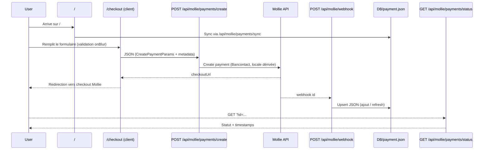

# Product Requirements Document: Mollie Payment POC (Front-first)

## 1. Overview

- **Project Name**: Mollie Payment POC (Next.js 16, front-centric)
- **Purpose**:  
  Démontrer une expérience front complète autour de l’intégration Mollie dans un app-router Next.js 16/React 19 : création de paiement guidée, suivi de statut, liste filtrable/paginée, avec stockage local JSON.
- **Key Outcomes**:
  1. Offrir un flux de checkout responsive avec validation en temps réel (Zod + feedback UI) et redirection sécurisée vers Mollie.
  2. Permettre aux équipes produit de visualiser/filtrer les paiements enrichis de métadonnées (office/tenant/product) depuis le front.
  3. Rejouer et déboguer les statuts (open/paid/failed/expired) via des écrans dédiés et une synchronisation simple avec Mollie.

---

## 2. Background & Strategic Fit

### 2.1 Current State

- Stack front : Next.js 16 (app router) + React 19 + Tailwind CSS 4, police Geist, components client only.
- Intégration Mollie via `@mollie/api-client`; persistance simulée dans `DB/payment.json` (FS).
- Parcours UI :  
  - `/` déclenche une synchro Mollie → JSON dès le montage.  
  - `/checkout` propose un formulaire complet avec validation progressive.  
  - `/payment` liste/pagine et filtre par métadonnées.  
  - `/payment/status` interroge l’API de statut pour afficher un écran contextualisé.

### 2.2 Opportunity

- Centrer la preuve de concept sur l’UX front : guidance, feedback visuel, validation, filtres et pagination pour rapprocher l’UI d’un cas métier multi-tenant.
- Dé-risquer l’intégration Mollie (locale, redirection, webhooks) sans dépendance infra forte grâce à un store JSON local.

---

## 3. Architecture

### 3.1 High-Level Diagram

```mermaid
flowchart TB
  subgraph Client (Next.js)
    Home["/ (auto-sync)"]
    Checkout["/checkout (form + validation)"]
    PaymentList["/payment (filters + pagination)"]
    PaymentStatus["/payment/status (UI statut)"]
  end

  subgraph AppRoutes (Next API)
    CreateAPI["POST /api/mollie/payments/create"]
    StatusAPI["GET /api/mollie/payments/status"]
    GetAllAPI["POST /api/mollie/payments/getAll"]
    SyncAPI["GET /api/mollie/payments/sync"]
    WebhookAPI["POST /api/mollie/webhook"]
    LocalStore["DB/payment.json"]
  end

  subgraph Mollie
    MollieAPI["Mollie Payments API"]
  end

  Checkout --> CreateAPI --> MollieAPI
  MollieAPI --> WebhookAPI --> LocalStore
  Home --> SyncAPI --> LocalStore
  PaymentList --> GetAllAPI --> LocalStore
  PaymentStatus --> StatusAPI --> MollieAPI
```

### 3.2 Detailed Interaction Flow



### 3.3 Component Responsibilities

| Layer / Component  | Responsibility |
| ------------------ | ------------- |
| **UI / Interface** | `app/page.tsx` (sync + CTA), `app/checkout/page.tsx` (formulaire avec validation visuelle), `app/payment/page.tsx` (filtres/pagination/cartes), `app/payment/status/page.tsx` (écran de statut) + `Select`/`checkoutButton`. |
| **API / Gateway**  | App routes de création, statut, listing filtré, sync et webhook. |
| **Core Logic**     | `lib/mollie.ts` (client, locale, création, lecture), `lib/validation.ts` (Zod, validation champ par champ), `lib/server-actions.ts` (FS sync, pagination côté API). |
| **Integrations**   | Mollie Payments API via `@mollie/api-client`. |
| **Data Storage**   | Fichier `DB/payment.json` (append/sync, pas de transactions). |

---

## 4. Module Design

### 4.1 Existing Modules (if any)

- **UI pages**  
  - `app/page.tsx` : déclenche la sync, CTA vers `/checkout`, mise en forme hero.  
  - `app/checkout/page.tsx` : validation progressive (onBlur), normalisation des montants, guidage visuel, redirection vers Mollie.  
  - `app/payment/page.tsx` : filtres multi-axes + pagination côté API, cartes statutées.  
  - `app/payment/status/page.tsx` : fetch du statut par id, état riche (paid/open/pending/failed/canceled/expired).

- **API routes**  
  - `app/api/mollie/payments/create/route.ts` : création Mollie + patch redirect/cancel.  
  - `app/api/mollie/payments/status/route.ts` : lecture statut live côté Mollie.  
  - `app/api/mollie/payments/getAll/route.ts` : filtre + pagination depuis `DB/payment.json`.  
  - `app/api/mollie/payments/sync/route.ts` : rapprochement Mollie → JSON.  
  - `app/api/mollie/webhook/route.ts` : réception webhook et tentative d’upsert (logique à fiabiliser).

- **Lib / services**  
  - `lib/mollie.ts` : création de paiement (Bancontact, locale par pays, metadata enrichie), lecture single/list.  
  - `lib/server-actions.ts` : lecture/écriture JSON, sync, pagination côté fs.  
  - `lib/validation.ts` : schéma Zod, validation champ par champ, helpers montant/URL.  
  - `lib/types.ts` : contrats front/API (CreatePaymentParams, Metadata, PaymentCustom).

- **UI components**  
  - `app/components/Select.tsx` : sélecteurs stylés + feedback d’erreur.  
  - `app/components/checkoutButton.tsx` : bouton soumis/disabled synchronisé à l’état réseau.

### 4.2 New Modules / Agents

1. **Webhook upsert robuste** – sécuriser `updatePaymentFromDB` (upsert + log) pour refléter les statuts sans duplication.  
2. **Reporting front** – ajout d’un panneau analytics (totaux, répartition par statut/tenant) pour les démos produit.  
3. **State cache côté status page** – éviter le double appel Mollie pour un même id (memoization/temp cache).

### 4.3 Inter-Module Protocols

- **Handoff / Routing** : JSON POST pour `create` et `getAll`; GET avec query `id` pour `status`; webhook en `application/x-www-form-urlencoded`.  
- **Shared State** : `DB/payment.json` centralise les écritures webhooks et les lectures front (getAll, sync).  
- **Persistence / Checkpointing** : append FS sans verrou; prévoir déduplication/upsert pour un usage prolongé.

---

## 5. Implementation Outline

```
project-root/
├── app/
│   ├── api/mollie/payments/{create,getAll,status,sync}/route.ts
│   ├── api/mollie/webhook/route.ts
│   ├── checkout/page.tsx
│   ├── payment/{page.tsx,status/page.tsx}
│   ├── components/{Select.tsx,checkoutButton.tsx}
│   ├── layout.tsx
│   └── page.tsx
├── lib/{mollie,server-actions,types,validation}.ts
├── DB/payment.json
└── package.json
```

- **Entry Point**: `app/page.tsx` (UI) + app routes dans `app/api/mollie/...`.  
- **Module Registration**: conventions Next.js app router (fichiers `route.ts`, pages server/client).  
- **API Contracts**: `CreatePaymentParams` (montant + adresse + metadata), `PaymentCustom` (metadata obligatoires), webhook Mollie `id` (form data).

---

## 6. Testing Strategy

- **Unit**  
  - Validation Zod (montant, codes pays, metadata requises).  
  - Helpers de locale/montant dans `lib/mollie.ts`.
- **Integration**  
  - App routes `create`, `status`, `getAll` avec FS mocké.  
  - Webhook upsert (cas paid/failed/expired).
- **End-to-End**  
  - Parcours `/checkout → Mollie → /payment/status` (mock Mollie ou sandbox).  
  - Filtres/pagination `/payment` (vérifier comptage/limites).  
  - Sync initiale `/` (nouveaux paiements ajoutés).
- **Gaps actuels** : aucune suite automatisée; uniquement vérifications manuelles via UI et inspection de `DB/payment.json`.

---

## 7. Deployment & Rollout

- **Build & Release**  
  `npm install` puis `npm run dev` en local; `npm run build && npm run start` pour un déploiement Next.  
  Variables nécessaires : `MOLLIE_API_KEY` (obligatoire), `NEXT_PUBLIC_BASE_URL`, `NEXT_PUBLIC_MOLLIE_WEBHOOK`; `NEXT_PUBLIC_MOLLIE_PROFILE_ID` si profil spécifique.  
  Stockage FS (`DB/payment.json`) non adapté à la prod (pas de verrouillage ni backup).
- **Feature Flags / Gating**  
  Aucun flag; un seul parcours. Possibilité d’en ajouter pour choisir la méthode de paiement ou activer la pagination côté Mollie.
- **Monitoring & Logging**  
  Logs console basiques sur creation/webhook; pas de traçage front ni d’APM. À prévoir : capture des erreurs fetch côté UI et alertes sur échec webhook.
